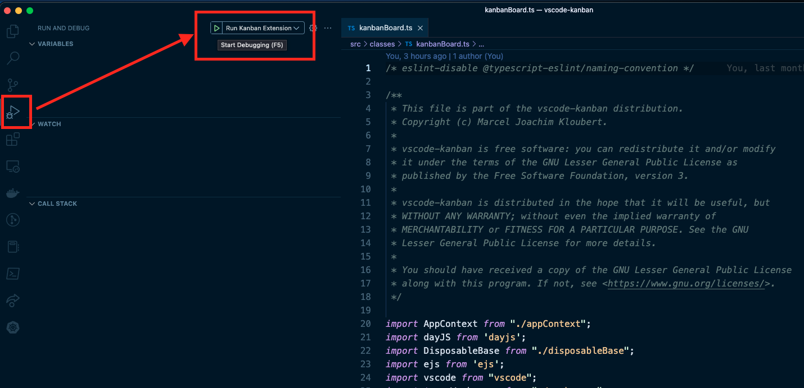
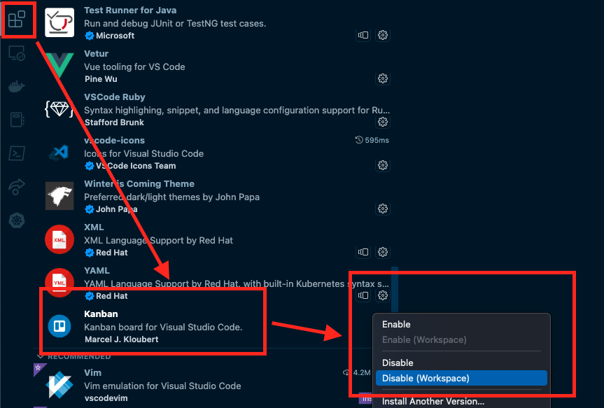

# Contribution guidelines

## Before you start

Before you start, you should [open an issue](https://github.com/vscode-kanban/vscode-kanban/issues) to describe what you plan to do, to prevent other people (and you) from working on the same thing.

The tasks will be organized in [Project area](https://github.com/orgs/vscode-kanban/projects/1/) later, if implementation is useful.

Exceptions are things, like bugfixes and important updates ... for this you can [create a pull request](https://github.com/vscode-kanban/vscode-kanban/pulls) directly, of course.

## Work with the code

First [fork the code](https://github.com/vscode-kanban/vscode-kanban/fork) and create a new branch.

After cloning your forked repository to your machine, keep sure to run [inside Node.js 16 or later](https://nodejs.org/en/blog/release/v16.0.0/) and with [npm 7 or later](https://www.npmjs.com/package/npm/), before you can run the following command from the root directory of the project:

```bash
npm install
```

In VSCode, do the following steps to start a debug session:



The [Command Palette](https://code.visualstudio.com/api/ux-guidelines/command-palette) of the new editor window should now provide new commands, starting with `Kanban:` prefix.

If you have already [the old extension installed](https://github.com/mkloubert/vscode-kanban), please deactivate it first:



## Extension class

The class, which helps to communicate between extension and Web UI, is called `KanbanBoard` and can be found in [kanbanBoard.ts file](./src/classes/kanbanBoard.ts).

## Web UI

All files for the WebView are inside [media/ folder](./media/).

The main template is realized in [main.ejs file](./media/main.ejs), which is parsed with [EJS template engine](https://ejs.co/).

The UI is based on CDN versions of the libraries [React](https://reactjs.org/) and [Babel](https://babeljs.io/).

Also version 5 of [MUI Core](https://mui.com/material-ui/getting-started/overview/) is included with this extension.

### Components

The main component, which is loaded at the beginning and rendered into the `#vscode-kanban-board` element of the template, is stored in [App.jsx file](./media/jsx/App.jsx).

The `.jsx` files of the sub components, are stored in [components/ folder](./media/jsx/components). All of these are loaded and parsed automatically by the `main` template.

#### Implement component

To implement a new component, lets say `MyFirstComponent`, simply create a [MyFirstComponent.jsx file](./media/jsx/components/MyFirstComponent.jsx) there, and start with the following code:

```jsx
/* eslint-disable @typescript-eslint/naming-convention */

/**
 * This file is part of the vscode-kanban distribution.
 * Copyright (c) Marcel Joachim Kloubert.
 *
 * vscode-kanban is free software: you can redistribute it and/or modify
 * it under the terms of the GNU Lesser General Public License as
 * published by the Free Software Foundation, version 3.
 *
 * vscode-kanban is distributed in the hope that it will be useful, but
 * WITHOUT ANY WARRANTY; without even the implied warranty of
 * MERCHANTABILITY or FITNESS FOR A PARTICULAR PURPOSE. See the GNU
 * Lesser General Public License for more details.
 *
 * You should have received a copy of the GNU Lesser General Public License
 * along with this program. If not, see <https://www.gnu.org/licenses/>.
 */

(() => {
  // https://mui.com/material-ui/getting-started/overview/
  const { Typography, useTheme } = MaterialUI;

  window.vscodeKanban.setUIComponent("MyFirstComponent", (props) => {
    // https://mui.com/material-ui/customization/default-theme/
    const theme = useTheme();

    return (
      <Typography variant="h1" gutterBottom>
        <span
          style={{
            color: theme.palette.text.primary,
          }}
        >
          {props.children}
        </span>
      </Typography>
    );
  });
})();
```

This will register a [function component](https://reactjs.org/docs/components-and-props.html) as `MyFirstComponent` globally, using `setUIComponent()` function, from the global [main.js file](./media/js/main.js).

Later you can access this component (and other ones), using `getUIComponents()` function:

```jsx
/// ... copyright header ...

(() => {
  window.vscodeKanban.setUIComponent("MySecondComponent", (props) => {
    const [MyFirstComponent, Icon, Markdown] =
      window.vscodeKanban.getUIComponents(
        "MyFirstComponent",

        // the following components are already
        // included
        "Icon",
        "Markdown"
      );

    const [counter, setCounter] = React.useState(0);

    const handleIconClick = React.useCallback(() => {
      setCounter(counter + 1);
    }, [counter]);

    return (
      <MyFirstComponent>
        <div onClick={handleIconClick}>
          <Icon>add</Icon>
        </div>

        <Markdown source={`# Counter\n\n${counter}`} />
      </MyFirstComponent>
    );
  });
})();
```

#### Global styles

All global styles are defined and stored in [main.css file](./media/css/main.css).

#### Icons and fonts

The main font is [Roboto](https://google-webfonts-helper.herokuapp.com/fonts/roboto?subsets=latin) and the following icon fonts are also embedded:

- [Material Icons](https://fonts.google.com/icons)
- [Font Awesome 6 (Free)](https://fontawesome.com/v6/download)

An easy way to use these fonts, is to make use of the `<Icon />` component:

```jsx
return (
  <React.Fragment>
    {/* Material UI icon */}
    <Icon>edit</Icon>
  </React.Fragment>
);
```

#### Global functions and constants

Global functions and constants are defined and stored in [main.js file](./media/js/main.js).

The custom functions and constants of the Web View are organized in the `window.vscodeKanban` namespace.

There is also special stuff, which can be accessed via [window object](https://developer.mozilla.org/en-US/docs/Web/API/Window) directly:

- `window.t()`: the global [i18next function](https://www.i18next.com/overview/api#t) ... the translations are stored in [i18n/ folder](./i18n/), which is also used by the extension itself
- `window.vscode`: created by `acquireVsCodeApi()` function: https://code.visualstudio.com/api/extension-guides/webview

## Translations

Translations are stored as JSON files in [i18n/ folder](./i18n/) and loaded automatcially by [AppContext](./src/classes/appContext.ts).

The file name has to be named with the short ISO code, like `fr.json`.

Take the [en.json file](./i18n/en.json) as foundation.

## Visual Studio Code commands

[Commands for VSCode](https://code.visualstudio.com/api/extension-guides/command), are managed inside [commands/ folder](./src/commands/).

### Implement command

To implement a new command, lets say `myCommand`, first create a [myCommand/ subfolder](./src/commands/myCommand/).

Create a new [index.ts/ file](./src/commands/myCommand/index.ts) and start with the following skeleton:

```typescript
/**
 * This file is part of the vscode-kanban distribution.
 * Copyright (c) Marcel Joachim Kloubert.
 *
 * vscode-kanban is free software: you can redistribute it and/or modify
 * it under the terms of the GNU Lesser General Public License as
 * published by the Free Software Foundation, version 3.
 *
 * vscode-kanban is distributed in the hope that it will be useful, but
 * WITHOUT ANY WARRANTY; without even the implied warranty of
 * MERCHANTABILITY or FITNESS FOR A PARTICULAR PURPOSE. See the GNU
 * Lesser General Public License for more details.
 *
 * You should have received a copy of the GNU Lesser General Public License
 * along with this program. If not, see <https://www.gnu.org/licenses/>.
 */

import path from "path";
import vscode from "vscode";
import type { CommandFactory, IInitializeCommandOptions } from "..";

const factory: CommandFactory = () => {
  return {
    initialize(options: IInitializeCommandOptions) {
      // access the `app` context
      const { app } = options;

      // this function, which is returned by this method,
      // will be used 1:1 as logic for the new command
      return async (...args: any[]): Promise<any> => {};
    },

    dispose() {
      // this can be used, when additional memory
      // cleanups have to be made
    },

    // this will take the directory name
    // as name of the command
    //
    // you do not need to change this
    name: path.basename(__dirname),
  };
};

export default factory;
```

As next step, add execution code in [extension.ts file](./src/extension.ts):

```typescript
/// ...

import myCommandCommand from "./commands/myCommand";

// code to activate the extension
export async function activate(context: vscode.ExtensionContext) {
  // ...

  await app.registerCommand(myCommandCommand);

  /// ...

  await app.start();
}

/// ...
```

The command will be now available via the ID `extension.kanban.myCommand`.

If the command should also be available in the [Command Palette
](https://code.visualstudio.com/api/ux-guidelines/command-palette), do not forget to update the `contributes.commands` section of the [package.json file](./package.json) ... s. [Creating a user facing command](https://code.visualstudio.com/api/extension-guides/command#creating-a-user-facing-command) for more information.
